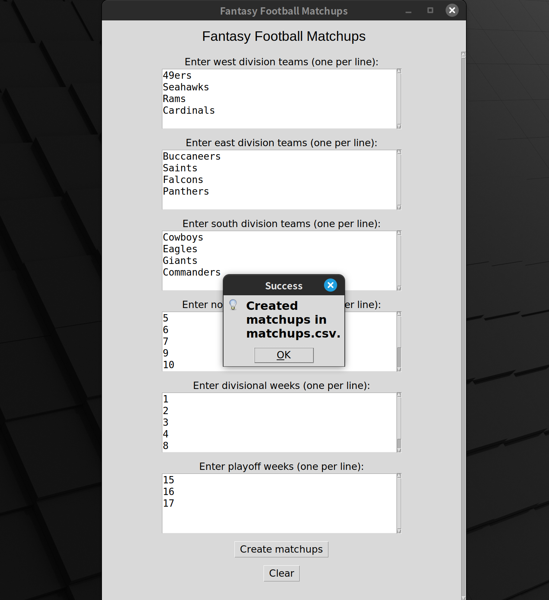

## Fantasy Football Matchup Script
This script creates random matchups of 4 teams from 3 fantasy football divisions.

The following rules are taken into account:
- During non-divisional weeks, only teams from different divisions are matched up. These matchups can only occur once the entire season.
- During divisional weeks, only teams from the same division are matched up. These matchups can occur only twice the entire season.

## Installation and Build
1) `git clone` this repo, download it as a `.zip`, or download the `matchups.py` file.
2) Ensure you have Python 3.10+ installed.
3) Ensure you have PyInstaller installed, if not run `pip install pyinstaller`.
4) Navigate to the root directory of the repo and run `pyinstaller --name=FantasyFootballMatchups --onefile --windowed main.py`.

Navigate to the `dist` directory created by PyInstaller. There is an executable file here called `FantasyFootballMatchups` that you can run by clicking from your desktop GUI. You can move this file to your `$HOME/Desktop` directory for visibility and ease of use.

## Usage
The `FantasyFootballMatchups` executable can be run simply by clicking on it. If it is on your desktop, click the icon on your desktop. Otherwise, navigate to it with your system's file explorer (File Explorer on Windows, Finder on MacOS, Nemo on Linux, etc.) and click on it from there.

The following `Fantasy Football Matchups` window will open. You can enter the names of your fantasy teams for each division as input, each on a new line. You can enter the different weeks of your season as input, each on a new line. the weeks of the season must be positive integers between 1 and 17 inclusive. Avoid entering blank lines or emtpy spaces.

Click the `Create Matchups` button to generate fantasy matchups which will be written to a `matchups.csv` file in the same folder as the `FantasyFootballMatchups` program. If the program is on your desktop, the `matchups.csv` file will show up there. This file can be opened in a spreadsheet application for ease of viewing (Excel on Windows, Numbers on MacOS, LibreOffice Calc on Linux, etc.).

The output will be written to a `matchups.csv` file in the same directory as the script. This file can be opened in Excel on Windows, Numbers on Mac, and LibreOffice Calc on Linux for ease of viewing.

## Feedback
Feel free to voice feedback and concerns in the [Issues](https://github.com/sabiq-khan/fantasy-football-matchups/issues).
